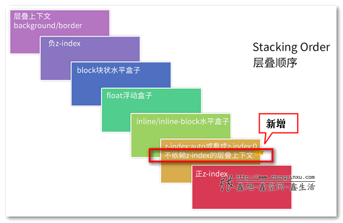

### 层叠上下文的创建

1. 页面根元素天生具有层叠上下文(html),称之为“根层叠上下文”

2. z-index 为数值的定位元素的传统层叠上下文

3. 其他 CSS3 属性:
   - z-index 不为 auto 的 flex 项(父元素:display:flex|inline-flex)
   - 元素的 opacity 值不是 1
   - 元素的 transform 值不是 none
   - 元素 mix-blend-mode 值不是 normal
   - 元素的 filter 值不是 none
   - 元素的 isolation 值是 isolate
   - will-change 指定的属性值为上面任意一个
   - 元素的-webkit-overflow-scrolling 设为 touch

---

### 层叠上下文的特性

- 层叠上下文的层叠水平要比普通元素高
- 层叠上下文可以阻断元素的混合模式
- 层叠上下文可以嵌套，内部层叠上下文及其所有子元素均受制于外部的层叠上下文
- 每个层叠上下文和兄弟元素独立，也就是当进行层叠变化或渲染的时候，只需要考虑后代元素
- 每个层叠上下文是自成体系的，当元素发生层叠的时候，整个元素被认为是在父层叠上下文的层叠顺序中。

---

### 层叠准则 s

1. 谁大谁上：当具有明显的层叠水平标识的时候，如 z-index,在同一个层叠上下文领域，层叠水平大的覆盖小的

2. 后来居上：当元素的层叠水平一致、层叠顺序相同，在 DOM 流中处于后面的元素覆盖前面的

---

### 层叠顺序

## 
