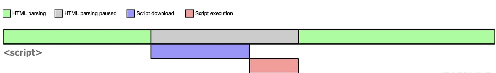
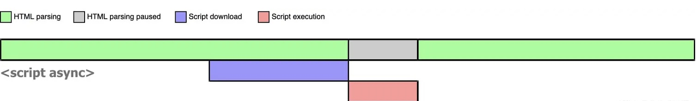
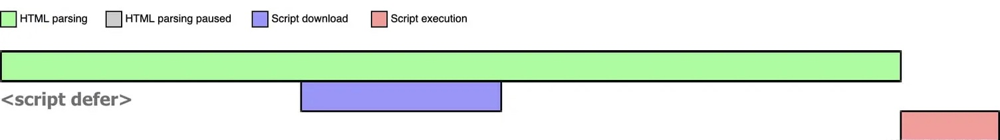

浏览器在解析 HTML 的时候,如果遇到没有任何属性的 script 标签,就会暂停解析先发送网络请求获取该 JS 脚本的代码内容,然后让 JS 引擎执行该代码,当代码执行完毕后恢复解析,如下图所示

### async script

当浏览器遇到带有 async 属性的 script 时,请求该脚本的网络请求是异步的,不会阻塞浏览器解析 HTML,一旦网络请求回来之后,如果此时 HTML 还没有解析完,浏览器会暂停解析,先让 js 引擎执行代码,执行完毕后再进行解析,如下图所示

async 是不可控的,执行时间完全取决于网络传输结果。如果在 async script 中获取 dom,有可能获取不到有可能获取的到。而且多个 async script 的执行顺序也是不可预测的

### defer script

当浏览器遇到带有 defer 属性的 script 时,请求该脚本的网络请求是异步的,如果请求回来之后,HTML 还没解析完,也不会暂停解析并执行 js 代码,而是等待 HTML 解析完成再执行 js 代码

| script 标签 | js 执行顺序      | 是否阻塞 HTML 解析 |
| ----------- | :--------------- | :----------------- |
| script      | 在 HTML 中的顺序 | 阻塞               |
| async       | 网络请求返回顺序 | 可能阻塞可能不阻塞 |
| defer       | 在 HTML 中的顺序 | 不阻塞             |

### css 是否阻塞 dom 渲染

css 加载不会阻塞 dom 解析,但会阻塞 dom 渲染,也会阻塞在其之后的 js 的执行

- 当浏览器解析 HTML 生成 DOM 树时，它也会并行下载 CSS 文件，并开始构建 CSSOM（CSS 对象模型）。DOM 和 CSSOM 的构建是并行进行的，这意味着 CSS 的下载和解析不会阻止 DOM 的构建。
- 渲染树是 DOM 树和 CSSOM 树结合的结果，渲染树的构建过程必须等待 CSSOM 树的构建完成,所以 css 会阻塞 dom 渲染
- css 阻塞 js: 保证样式计算的准确性、避免重排和重绘、依赖解析顺序
