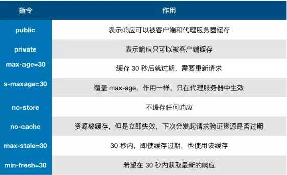

## 前言

> 缓存可以说时性能优化中最简单高效的优化方式了。一个优秀的缓存策略可以缩短网页请求资源的距离，减少延迟，并且由于缓存文件可以重复利用，还可以减少带宽，降低网络负荷。

---

## 缓存过程分析

**浏览器对于缓存的处理是根据第一次请求资源时返回的响应头来确定的**

<!--  -->

- 浏览器每次发起请求，都会先在浏览器缓存中查找该请求结果以及缓存标识

- 浏览器每次拿到返回的请求结果都会将该结果和缓存标识存入浏览器缓存中

## 根据是否需要重新向服务器发起 HTTP 请求将缓存分为**强缓存**和**协商缓存**

## 强缓存

> 不会向服务器发送请求，直接从缓存中读取资源。可以通过设置以下两种 HTTP Header 实现：Expires 和 Cache-Control

### Expires: 缓存过期时间，用来指定资源到期的时间，是服务器端的具体时间点

Expires 需要和 Last-modified 结合使用。Expires 是 Web 服务器响应消息头字段，在响应 http 请求时告诉浏览器在过期时间前浏览器可以直接从浏览器缓存取数据，而无需再次请求。**Expires 是 HTTP/1 的产物，受限于本地时间，如果修改了本地时间，可能会造成缓存失效。**

### Cache-Control

在 HTTP/1.1 中 Cache-Control 是最重要的规则，主要用于控制网页缓存。Cache-Control 可在请求头或者响应头中设置，如下所示：

<!--  -->

### Expires 和 Cache-Control 两者对比

## 区别就在于 Expires 是 http1.0 的产物，Cache-Control 是 http1.1 的产物，两者同时存在的话，Cache-Control 优先级高于 Expires；在某些不支持 HTTP1.1 的环境下，Expires 就会发挥用处。所以 Expires 其实是过时的产物，现阶段它的存在只是一种兼容性的写法。

## 协商缓存

> 协商缓存就是强制缓存失效后，浏览器携带缓存标识向服务器发起请求，由服务器根据缓存标识决定是否使用缓存的过程，主要有以下两种情况：

- 协商缓存生效，返回 304 和 Not Modified

- 协商缓存失效，返回 200 和请求结果

协商缓存可以通过设置两种 HTTP Header 实现：Last-Modified 和 ETag

### Last-Modified 和 If-Modified-Since

浏览器在第一次访问资源时，服务器返回资源的同时，在 response header 中添加 Last-Modified 的 header，值是这个资源在服务器上的最后修改时间，浏览器接收后缓存文件和 header

浏览器下一次请求这个资源，浏览器检测到有 Last-Modified 这个 header，于是添加 If-Modified-Since 这个 header，值就是 Last-Modified 中的值；服务器再次收到这个资源请求，会根据 If-Modified-Since 中的值与服务器中这个资源的最后修改时间对比，如果没有变化，返回 304 和空的响应体，直接从缓存读取，如果 If-Modified-Since 的时间小于服务器中这个资源的最后修改时间，说明文件有更新，于是返回新的资源文件和 200

**但 Last-Modified 存在一些缺点**

- 如果本地打开缓存文件，即使没有对文件进行修改，但还是会造成 Last-Modified 被修改，服务端不能命中缓存导致发送相同的资源

- 因为 Last-Modified 只能以秒计时，如果在不可感知的时间内修改完成文件，那么服务端会认为资源还是命中了，不会返回正确的资源

### ETag 和 If-None-Match

Etag 是服务器响应请求时，返回当前资源文件的一个唯一标识(由服务器生成)，只要资源有变化，Etag 就会重新生成

浏览器在下一次加载资源向服务器发送请求时，会将上一次返回的 Etag 值放到 request header 里的 If-None-Match 里，服务器只需要比较客户端传来的 If-None-Match 跟自己服务器上该资源的 ETag 是否一致，就能很好地判断资源相对客户端而言是否被修改过了。如果服务器发现 ETag 匹配不上，那么直接以常规 GET 200 回包形式将新的资源（当然也包括了新的 ETag）发给客户端；如果 ETag 是一致的，则直接返回 304 知会客户端直接使用本地缓存即可。

---
