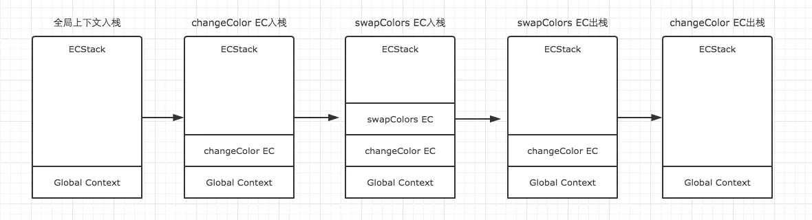

## 执行上下文是什么

### 每当 JS 引擎遇到可执行代码时，就会进入一个执行上下文，执行上下文可以理解为当前代码的**执行环境**，它会形成一个作用域

---

## 执行上下文的类型

- 全局执行上下文：这是默认的或者说基础的执行上下文，任何不在函数内部的代码都在全局上下文中。它会干两件事，创建一个全局的 Window 对象（浏览器环境）,并设置 this 的值为这个全局对象
- 函数执行上下文：在函数被调用的时候，会为它创建一个上下文，压入执行栈中
- eval 执行上下文： 存在性能问题，不使用

---

## 我们用下面一段代码来模拟执行上下文的创建过程

```
var color = 'blue';

function changeColor() {
  var anotherColor = 'red';

  function swapColors() {
    var tempColor = anotherColor;
    anotherColor = color;
    color = tempColor;
  }

  swapColors();
}

changeColor();
```

1. 执行代码，首先全局上下文入栈
2. 遇到 changeColor 函数调用，changeColor 执行上下文入栈
3. 在 changeColor 运行的过程中，遇到 swapColors()函数调用，swapColors 执行上下文入栈
4. swapColors 执行完毕，从栈中弹出
5. changeColor 上下文出栈
6. **全局上下文在浏览器窗口关闭后出栈**
   <!--  -->

---

## 执行上下文的生命周期

<!-- ##  -->

### 变量对象

> 变量对象与活动对象其实是同一个对象，只是处于执行上下文的不同生命周期。只有处于执行栈栈顶的执行上下文中的变量对象，才能变成活动对象

1. 创建 arguments 对象
2. 检查当前上下文的函数声明，就是使用 function 关键字声明的函数。在变量对象中以函数名建立一个属性，属性值为指向该函数内存地址的引用
3. 检查当前上下文的变量声明，每找到一个变量声明，就在变量对象中以变量名建立一个属性，属性值为 undefined
   > let/const 声明的变量，任然会被收集到变量对象中，但和 var 不同，let/const 定义的变量，不会在这个时候给它赋值 undefined。因为没有赋值，即使变量提升了，我们也不能在赋值之前调用它，这就是常说的**暂时性死区**

---

### 作用域链

> 作用域是一套规则——这套规则用来管理 JS 引擎如何在当前作用域以及嵌套的子作用域中根据标识符名称进行变量查找

> 作用域链————当查找变量的时候，会先从当前上下文的变量对象中查找，如果没有找到，就会从父级执行上下文的变量对象中查找，一直找到全局上下文的变量对象，也就是全局对象。**这样由多个执行上下文的变量对象构成的链表就叫做作用域链**

---

### this 指向是在函数被调用的时候确定的

> 如果调用者函数，被某一个对象所拥有，那么该函数在调用时，内部的 this 指向该对象。如果函数独立调用，那么该函数内部的 this，则指向 undefined
