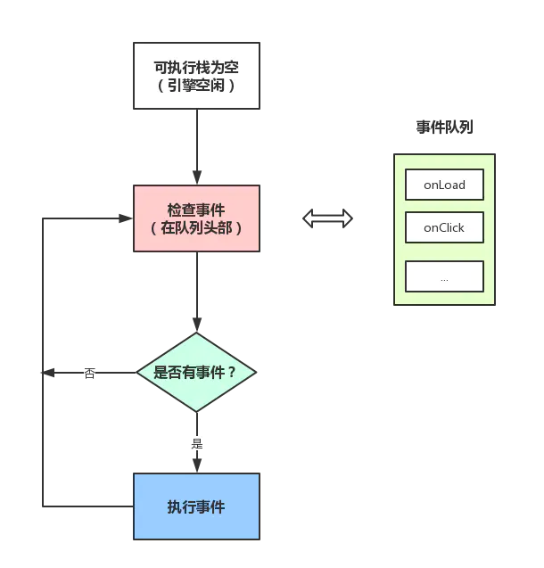
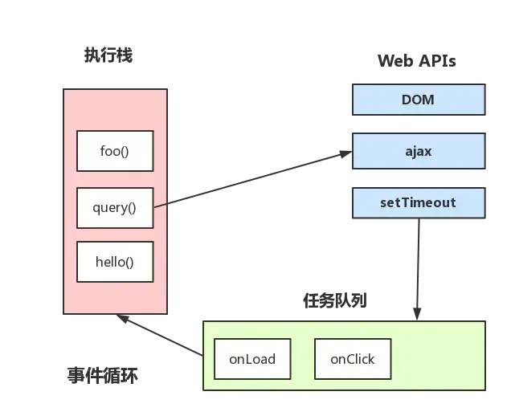
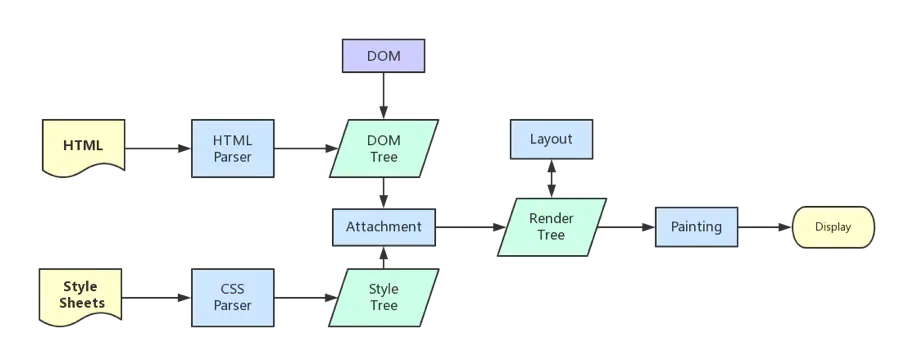

## 从 EventLoop 谈 JS 的运行机制

- JS 分为同步任务和异步任务
- 同步任务在主线程上执行，形成一个执行栈
- 主线程之外，**事件触发线程**管理着一个任务队列，只要异步任务有了结果，就在任务队列里放置一个事件
- 一旦执行栈中所有的同步任务执行完毕（JS 引擎空闲）,就会读取任务队列，将可运行的异步任务添加到可执行栈中，开始执行
  

---

上图的大致描述就是：

- 主线程运行时会产生执行栈，栈中的代码调用某些 api 时，会在事件队列中添加各种事件
- 当栈中的代码执行完毕，就会读取事件队列中的事件，去执行那些回调
- 一直循环
- **总要等到栈中的代码执行完毕后才会去读取事件队列中的事件**

---

## macrotask 与 microtask

- macrotask（又称宏任务），可以理解是每次执行栈执行的代码就是一个宏任务（包括每次从事件队列中获取一个事件回调并放在执行栈中执行）
- 每个 task 会从头到尾将这个任务执行完毕，不会执行其它

## 浏览器渲染进程

浏览器渲染进程是多线程的，下面列举包含了哪些线程

### 1. GUI 渲染线程

- 负责渲染浏览器界面，解析 HTML、CSS、构建 DOM 树和 Render 树，布局和绘制等
- 当界面需要重绘(Repanint)或由于某种操作引发回流(reflow)时，该线程就会执行
- _GUI 渲染线程与 JS 引擎线程是互斥的，当 JS 引擎执行时 GUI 线程会被挂起（相当于被冻结了）,GUI 更新会被保存在一个队列中等到 JS 引擎空闲时立即被执行_

### 2. JS 引擎线程

- 负责解析 JavaScript 脚本，运行代码（例如 V8 引擎）
- JS 引擎一直等待着任务队列中任务的到来，然后加以处理，一个 Tab 页(Render 进程)中无论什么时候都只有一个 JS 线程在运行
- 由于 GUI 渲染线程与 JS 引擎线程时互斥的，所以所过 JS 执行的事件过长，就会造成页面的渲染不连贯，导致页面渲染加载阻塞

### 3. 事件触发线程

- _归属于浏览器而不是 JS 引擎，用来控制事件循环_，（JS 引擎自己忙不过来，需要浏览器另开线程协助）
- 当 JS 引擎执行代码块如 setTimeout 时(也可来自浏览器内核的其它线程、如鼠标点击事件、AJAX 异步请求等)，会将对应的任务添加到事件线程中
- 当对应的事件符合触发条件被触发时，该线程会把事件添加到待处理队列的队尾，等待 JS 引擎的处理
- 由于 JS 单线程的原因，所以这些待处理队列中的事件都得排队等待 JS 引擎处理（当 JS 引擎空闲时才会去执行）

### 4. 定时器触发器线程

- 传说中 setInterval 和 setTimeout 所在的线程
- 浏览器定时计数器并不是由 JS 引擎计数的（因为 JS 引擎是单线程的，如果处于阻塞线程状态就会影响计时的准确性）
- 因此单独线程来计时并触发定时（计时完毕后，添加到事件队列中，等待 JS 引擎空闲后执行）
- _W3C 在 HTML 标准中规定，规定要求 setTimeout 中低于 4ms 的时间间隔算作 4ms_

### 5. 异步 http 请求线程

- 在 XMLHttpRequest 在连接后是通过浏览器新开一个线程请求
- 检测到状态变更时，如果设置有回调函数，异步线程就产生状态变更事件，将这个回调函数放入事件队列中，等待 JS 引擎执行
  

---

## JS 引擎为什么是单线程

JavaScript 的单线程，与它的用途有关。作为浏览器脚本语言，JavaScript 的主要作用是与用户交互，以及操作 DOM。这中特性决定了它只能是单线程，否则会带来很负责的同步问题。比如，假定 JavaScript 同时有两个线程，一个线程在某个节点添加内容，另一个线程删除这个节点，这是浏览器不知道以哪个线程为准。

为了利用多核 CPU 的计算能力，HTML5 提出 Web Worker 标准，允许 JavaScript 脚本创建多个线程，但是子线程完全受主线程控制，且不得操作 DOM。所以，这个新标准并没有改变 JavaScript 单线程的本质。

---

## GUI 渲染线程与 JS 引擎线程互斥

由于 JavaScript 是可以操作 DOM 的，如果在修改这些元素属性的同时渲染界面（即 JS 线程与 GUI 线程同时运行），那么渲染线程前后获得的元素数据就可能不一致了。

因此，为了防止渲染出现不可预期的结果，浏览器设置 GUI 渲染线程与 JS 线程为互斥的关系，当 JS 线程执行时 GUI 线程会被挂起，GUI 更新会被保存在一个队列中等到 JS 线程空闲时立即执行。

---

## JS 阻塞页面加载

由上述互斥关系，可以推导出，JS 如果执行时间过长就会阻塞页面。

譬如，假设 JS 引擎正在进行巨量的计算，此时就算 GUI 有更新，也会被保存到队列中，等待 JS 引擎空闲后执行。 然后，由于巨量计算，所以 JS 引擎很可能很久很久后才能空闲，自然会感觉到巨卡无比。

所以，要尽量避免 JS 执行时间过长，这样就会造成页面的渲染不连贯，导致页面渲染加载阻塞的感觉。

---

## 浏览器渲染流程

1. 解析 html 建立 dom 树
2. 解析 css 构建 css 样式树(然后结合 dom 树合并成 render 树)
3. 布局 render 树（Layout/reflow）,负责各元素尺寸、位置的计算
4. 绘制 render 树（paint），绘制页面像素信息
5. 浏览器会将各层的信息发送给 GPU,GPU 会将各层合成（composite），显示在屏幕上
   

---

## load 事件与 DOMContentLoaded 事件

- 当 DOMContentLoaded 事件触发时，仅当 DOM 加载完成，不包括 CSS、图片等资源
- 当 onload 事件触发时，页面上所有的 DOM、样式表、脚本、图片都已经加载完成

所以，DOMContentLoaded 先于 load

---
