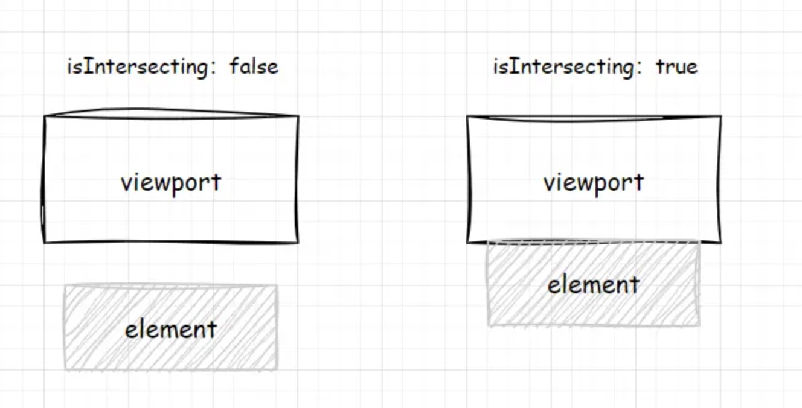
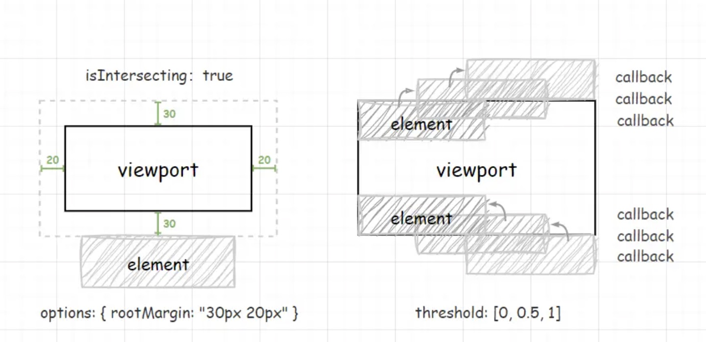

## IntersectionObserver

提供了一种创建 IntersectionObserver 对象的方法，对象用于**监测目标元素与视窗的交叉状态**，并在交叉状态变化时执行回调函数，回调函数可以接收到元素与视窗交叉的具体数据



一个 IntersectionObserver 对象可以监听多个元素

IntersectionObserver 特别适用于：滚动动画、懒加载、虚拟列表等场景

### 使用方法

IntersectionObserver 构造函数接收两个参数

- callback:当元素可见比例达到指定阈值后触发的回调函数
- options:
  - root: 所监听对象的具体祖先元素，默认使用顶级文档的视窗(一般为 html)
  - rootMargin: 计算交叉时添加到根(root)边界盒 bounding box 的矩形偏移量
  - threshold: 一个包含阈值的列表, 按升序排列, 列表中的每个阈值都是监听对象的交叉区域与边界区域的比率。当监听对象的任何阈值被越过时，都会触发 callback。默认值为 0。
    

IntersectionObserver 构造函数 返回观察器实例，实例携带四个方法

- observe: 开始监听目标元素
- unobserve: 停止监听目标元素
- disconnect: 关闭观察器
- takeRecords: 返回所有观察目标的 IntersectionObserverEntry 对象数组

```
// 调用构造函数 生成IntersectionObserver观察器
const myObserver = new IntersectionObserver(callback, options);

// 开始监听 指定元素
myObserver.observe(element);

// 停止对目标的监听
myObserver.unobserve(element);

// 关闭观察器
myObserver.disconnect();
```

### 使用场景

1. 图片懒加载

```
const observer = new IntersectionObserver((entries) => {
  entries.forEach((entry) => {
    if (entry.isIntersecting) {
      const img = entry.target;
      img.src = img.dataset.src; // 将真实的图片地址赋给 src 属性
      observer.unobserve(img); // 停止观察该图片
    }
  });
});

const lazyImages = document.querySelectorAll('.lazy-image');
lazyImages.forEach((img) => {
  observer.observe(img); // 开始观察每个图片元素
});

```

2. 无限滚动加载

```
const observer = new IntersectionObserver((entries) => {
  entries.forEach((entry) => {
    if (entry.isIntersecting) {
      loadMoreData(); // 触发数据加载操作
    }
  });
});

const loader = document.querySelector('.loader');
observer.observe(loader); // 开始观察加载指示器元素
```
