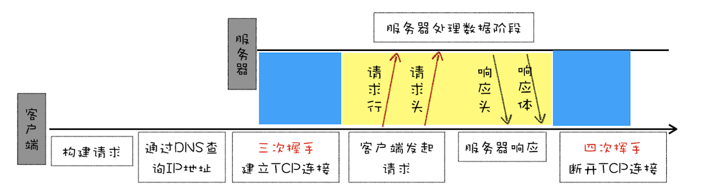
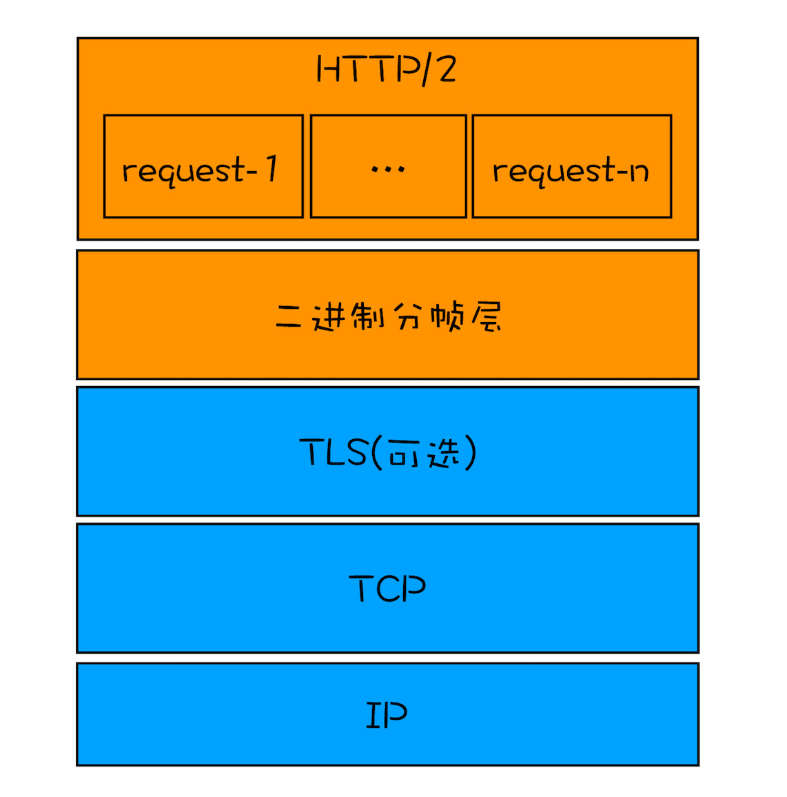

## HTTP/0.9

> HTTP/0.9 是于 1991 年提出的，需求很简单————用来在网络之间传递 HTML 超文本的内容，所以被称为**超文本传输协议**。基于请求响应的模式，从客户端发出请求，服务端返回数据。

### 一个完整的请求流程

- 建立 TCP 连接，因为 HTTP 都是基于 TCP 协议的，所以客户端先要根据 IP 地址，端口号和服务器建立 TCP 连接，三次握手的过程
- 建立好连接后，会发送一个 GET 请求行的信息，如 GET/index.html 用来获取 index.html
- 服务器接收请求信息后，读取对应的 HTML 文件，并将数据以 ASCII 字符流返回给客户端
- HTML 文档传输完成，断开连接
  

### 有以下三个特点

- 只有一个请求行，没有 HTTP 请求头和请求体，因为只需要一个请求行就可以完整的表达客户端的需求了
- 服务器也没有返回头信息，因为服务器并不需要告诉客户端太多信息，只需要返回数据就可以了
- 返回的文件内容是以 ASCII 字符流来传输的,因为都是 HTML 格式的文件，所以使用 ASCII 字节码来传输是最合适的。

---

## HTTP/1.0

随着万维网的不断发展，带来了很多新的需求，而 HTTP/0.9 已经不能适用新兴网络的发展，所以这时就需要一个新的协议来支撑新兴网络，这就是 HTTP/1.0 诞生的原因

首先浏览器中展示的不单是 HTML 文件了，还包括了 JavaScript、CSS、图片、音频、视频等不同类型的文件，因此**支持多种类型的文件下载是 HTTP/1.0 的一个核心诉求**

HTTP/1.0 引入了请求头和响应头，它们都是以 key-value 形式保存的，在 HTTP 发送请求时，会带上请求头信息，服务器返回数据时，会返回响应头信息。



### HTTP/1.0 怎么通过请求头和响应头来支持多种不同类型的数据

- 首先，浏览器需要知道服务器返回的数据是什么类型，然后浏览器才能根据不同的数据类型做针对性的处理

- 其次，为了减轻出书性能，服务器会对数据进行压缩后再传输，所以浏览器需要知道服务器压缩的方法

- 再次，由于万维网是全球性的，所以需要提供国际化支持，服务器需要对不同的地区提供不同的语言版本

- 最后，由于增加了各种不同类型的文件，而每种文件的编码形式又可能不一样，为了能够准确地读取文件，浏览器需要知道文件的编码类型

```
accept: text/html //期望返回html类型的文件
accept-encoding: gzip, deflate, br //期望服务器采用gzip、deflate或br其中的一种压缩方式
accept-Charset: ISO-8859-1,utf-8 //期望返回的文件编码是utf-8或ISO-8859-1
accept-language: zh-CN,zh //期望页面的优先语言是中文
```

### 除了对多文件提供良好的支持外，还引入了很多其它特性

- 有的请求服务器可能无法处理，或者处理出错，这时候就需要告诉浏览器最终的处理情况，这就引入了状态码，状态码是通过响应行的方式来通知浏览器的

  - 2XX 成功
    - 200 OK:表示从客户端发来的请求在服务器端被正确处理
    - 204 No content: 表示请求成功，但响应报文不含实体的主体部分
    - 206 Partial Content: 进行范围请求
  - 3XX 重定向
    - 301 moved permanently: 永久性重定向，表示资源已被分配了新的 URL
    - 302 found，临时性重定向，表示资源临时被分配了新的 URL
    - 303 see other，表示资源存在着另一个 URL，应使用 GET 方法定向获取资源
    - 304 not modified，表示服务器允许访问资源，但因发生请求未满足条件的情况
    - 307 temporary redirect，临时重定向，和 302 含义相同
  - 4XX 客户端错误
    - 400 bad request，请求报文存在语法错误
    - 401 unauthorized，表示发送的请求需要有通过 HTTP 认证的认证信息
    - 403 forbidden，表示对请求资源的访问被服务器拒绝
    - 404 not found，表示在服务器上没有找到请求的资源
  - 5XX 服务器错误
    - 500 internal sever error，表示服务器端在执行请求时发生了错误
    - 503 service unavailable，表明服务器暂时处于超负载或正在停机维护，无法处理请求

- 为了减轻服务器的压力，在 HTTP/1.0 中提供了 Cache 机制

- 服务器需要统计客户端的基础信息，比如 Windows 和 macOS 的用户数量分别是多少，所以 HTTP/1.0 的请求头中还加入了用户代理的字段。

---

## HTTP/1.1

> 不过随着技术的继续发展，需求也在不断迭代更新，很快 HTTP/1.0 也不能满足需求了，所以 HTTP/1.1 又在 HTTP/1.0 的基础之上做了大量的更新。接下来我们来看看 HTTP/1.0 遇到了哪些主要的问题，以及 HTTP/1.1 又是如何改进的。

### 1.改进持久连接

HTTP/1.0 每进行一次 HTTP 通信，都需要经历建立 TCP 连接、传输 HTTP 数据和断开 TCP 连接三个阶段。为了解决这个问题，HTTP/1.1 中增加了持久连接的方法，它的特点是在一个 TCP 上可以传输多个 HTTP 请求，只要浏览器或服务器没有明确的断开连接，那么该 TCP 连接会一直保持。

持久连接在 HTTP/1.1 中是默认开启的，所以你不需要专门为了持久连接去 HTTP 请求头设置信息，如果你不想要采用持久连接，可以在 HTTP 请求头中加上 Connection: close。**目前浏览器中对于同一个域名，默认允许同时建立 6 个 TCP 持久连接。**

### 2.不成熟的 HTTP 管线化

持久连接虽然能减少 TCP 的建立和连接次数，但是它需要等待前面的请求返回后，才能进行下一次请求。如果 TCP 通道中的某个请求没有及时返回，那么就会阻塞后面的所有请求，这就是著名的**对头阻塞**的问题。

### 3.提供虚拟主机的支持

在 HTTP/1.0 中，每个域名绑定了一个唯一的 IP 地址，因此一个服务器只能支持一个域名。但是随着虚拟主机技术的发展，需要实现在一台物理主机上绑定多个虚拟主机，每个虚拟主机都有自己的单独的域名，这些单独的域名都公用同一个 IP 地址。

因此，HTTP/1.1 的请求头中增加了**Host**字段，用来表示当前的域名地址，这样服务器就可以根据不同的 Host 值做不同的处理。

### 4.对动态生成的内容提供了完美支持

### 5.客户端 Cookie、安全机制

---

## HTTP/2.0

### HTTP/1.1 的主要问题：对带宽的利用率不理想

主要由以下三个原因导致：

1. TCP 的慢启动

2. 同时开启了多条 TCP 连接,这些连接会竞争固定的带宽

3. HTTP/1.1 对头阻塞问题

---

### 为了解决以上问题，引入 HTTP/2 协议：一个域名只使用一个 TCP 长连接和消除对头阻塞问题


该图就是 HTTP/2 最核心、最重要且最具颠覆性的**多路复用机制**。从图中你会发现每个请求都有一个对应的 ID，如 stream1 表示 index.html 的请求，stream2 表示 foo.css 的请求。这样在浏览器端，就可以随时将请求发送给服务器了。

服务器端接收到这些请求后，会根据自己的喜好来决定优先返回哪些内容，比如服务器可能早就缓存好了 index.html 和 bar.js 的响应头信息，那么当接收到请求的时候就可以立即把 index.html 和 bar.js 的响应头信息返回给浏览器，然后再将 index.html 和 bar.js 的响应体数据返回给浏览器。之所以可以随意发送，是因为每份数据都有对应的 ID，浏览器接收到之后，会筛选出相同 ID 的内容，将其拼接为完整的 HTTP 响应数据。

HTTP/2 使用了多路复用技术，可以将请求分成一帧一帧的数据去传输，这样带来了一个额外的好处，就是当收到一个优先级高的请求时，比如接收到 JavaScript 或者 CSS 关键资源的请求，服务器可以暂停之前的请求来优先处理关键资源的请求。

---

### 多路复用的实现



- 首先，浏览器准备好请求数据，包括了请求行、请求头等信息，如果是 POST 方法，那么还要有请求体。

- 这些数据经过二进制分帧层处理之后，会被转换为一个个带有请求 ID 编号的帧，通过协议栈将这些帧发送给服务器。

- 服务器接收到所有帧之后，会将所有相同 ID 的帧合并为一条完整的请求信息。

- 然后服务器处理该条请求，并将处理的响应行、响应头和响应体分别发送至二进制分帧层。

- 同样，二进制分帧层会将这些响应数据转换为一个个带有请求 ID 编号的帧，经过协议栈发送给浏览器。

- 浏览器接收到响应帧之后，会根据 ID 编号将帧的数据提交给对应的请求。

---

### HTTP/2 其他特性

1. 可以设置请求的优先级

2. 服务器推送

3. 头部压缩

## TCP 协议

### 三次握手建立连接

> TCP 是面向连接的，无论哪一方向另一方发送数据之前，都必须先在双方之间建立一条连接。在 TCP/IP 协议中，TCP 协议提供可靠的连接服务，连接通过三次握手进行初始化。三次握手的目的是同步连接双方的序列号和确认号并交换 TCP 窗口大小信息。TCP 连接是全双工的，数据在两个方向上能同时传递。

- 第一次握手：建立连接，客户端发送连接请求报文段，将 SYN 置为 1，Sequence Number 置为 X。然后客户端进入 SYN_SEND 状态，等待服务器的确认

- 第二次握手：服务器收到客户端的 SYN 报文段，需要对这个 SYN 报文段进行确认，设置 ACK(Acknowledgment Number)为 X+1;同时自己还要发送 SYN 请求信息，将 SYN 置为 1，Sequence Number 置为 Y;服务器将上述所有信息放到一个报文段中，一并发送给客户端，此时服务器进入 SYN_RECV 状态
- 第三次握手：客户端收到服务器的 SYN+ACK 报文段。然后将 Acknowledgment Number 设置为 y+1，向服务器发送 ACK 报文段，这个报文段发送完毕以后，客户端和服务器端都进入 ESTABLISHED 状态，完成 TCP 三次握手。

---

### 四次挥手断开连接

> TCP 协议是一种面向连接的、可靠的、基于字节流的运输层通信协议。**TCP 是全双工模式**，这就意味着，当主机 1 发出 FIN 报文段时，只是表示主机 1 已经没有数据要发送了，主机 1 告诉主机 2，它的数据已经全部发送完毕了；但是，这个时候主机 1 还是可以接受来自主机 2 的数据；当主机 2 返回 ACK 报文段时，表示它已经知道主机 1 没有数据发送了，但是主机 2 还是可以发送数据到主机 1 的；当主机 2 也发送了 FIN 报文段时，这个时候就表示主机 2 也没有数据要发送了，就会告诉主机 1，我也没有数据要发送了，之后彼此就会愉快的中断这次 TCP 连接。
> FIN：关闭连接标识
> SYN：建立新连接时，该位为 0
> ACK：确认标识，连接建立成功后，总为 1
> RST:复位标识，重建连接

- 第一次分手：主机 1(可以是客户端，也可以是服务器端),设置了 Sequence Number 为 X，向主机 2 发送一个 FIN 报文段。此时主机 1 进入 FIN_WAIT_1 状态，表示主机 1 没有数据要发送给主机 2 了

- 第二次分手：主机 2 收到了主机 1 发送的 FIN 报文段，向主机 1 回一个 ACK 报文段，ACK 为 Sequence Number+1，主机 1 进入 FIN_WAIT_2 状态，主机 2 告诉主机 1，我同意你的关闭请求
- 第三次请求：主机 2 向主机 1 发送 FIN 报文段，请求关闭连接，同时主机 2 进入 LAST_ACK 状态；
- 第四次请求：主机 1 收到主机 2 发送的 FIN 报文段，向主机 2 发送 ACK 报文段，然后主机 1 进入 TIME_WAIT 状态；主机 2 收到主机 1 的 ACK 报文段以后，就关闭连接；此时，主机 1 等待 2MSL 后依然没有收到回复，则证明 Server 端已正常关闭，那好，主机 1 也可以关闭连接了

---

### 为什么要等待 2MSL

> MSL: 报文段最大生存时间，它是任何报文段被丢弃前在网络内的最长时间

- 保证 TCP 协议的全双工连接能够可靠关闭
- 保证这次连接的重复数据段从网络中消失
