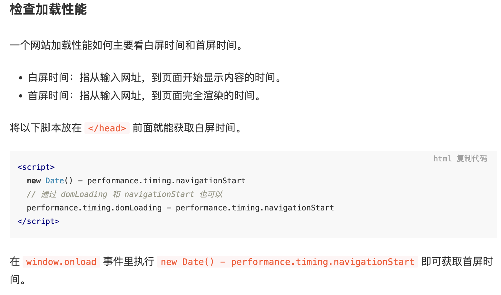

## 前端性能优化（加载时优化、运行时优化）

1.  减少 http 请求
    - url-loader 将小图片转成 base64 格式
    - 图标采用 font-face
2.  使用 http2
    - 解析速度快
    - 多路复用：
      - http1.1 如果要同时发送多个请求，需要建立多个 TCP 连接，一个 TCP 连接只能处理一个 http1.1 请求
      - 在 http2 中，多个请求可以共用一个 TCP 连接，这称为多路复用。同一个请求和响应用一个流来表示，并有唯一的流 ID，多个请求和响应可以乱序发送，达到目的地后再通过流 ID 重新组建
    - 首部压缩
    - 优先级
    - 流量控制
    - 服务器推送
3.  服务端渲染
4.  静态资源使用 CDN
5.  将 CSS 放在头部，JS 放在底部，更快的解析页面
6.  使用字体图标 iconfont 代替图片图标
7.  善用缓存，不重复加载相同的资源
8.  压缩文件

    - js: JavaScript：UglifyPlugin
    - CSS ：MiniCssExtractPlugin
    - HTML：HtmlWebpackPlugin
    - gzip 压缩

    ```
    npm install compression-webpack-plugin --save-dev
    npm install compression

    const CompressionPlugin = require('compression-webpack-plugin');
    module.exports = {
    plugins: [new CompressionPlugin()],
    }
    ```

9.  图片优化
    - 图片懒加载
    - 响应式图片
    - 调整图片大小
    - 降低图片质量（image-webpack-loader）
    - 能用 css 实现尽量用 css 实现
    - 使用 webp 格式的图片
10. 通过 webpack 按需加载代码，提取第三库代码，减少 ES6 转为 ES5 的冗余代码

    - 提取第三方库

    ```
    optimization: {
    runtimeChunk: {
    name: 'manifest' // 将 webpack 的 runtime 代码拆分为一个单独的 chunk。
    },
    splitChunks: {
    cacheGroups: {
    vendor: {
    name: 'chunk-vendors',
    test: /[\\/]node_modules[\\/]/,
    priority: -10,
    chunks: 'initial'
    },
    common: {
    name: 'chunk-common',
    minChunks: 2,
    priority: -20,
    chunks: 'initial',
    reuseExistingChunk: true
    }
    },
    }
    },

    ```

    - 减少 ES6 转为 ES5 的冗余代码(@babel/plugin-transform-runtime @babel/runtime)

11. 减少重排和重绘
12. 使用事件委托
13. 使用 requestAnimationFrame 来实现视觉变化
14. 降低 CSS 选择器的复杂度
15. 使用 transform 和 opacity 来实现动画
    
