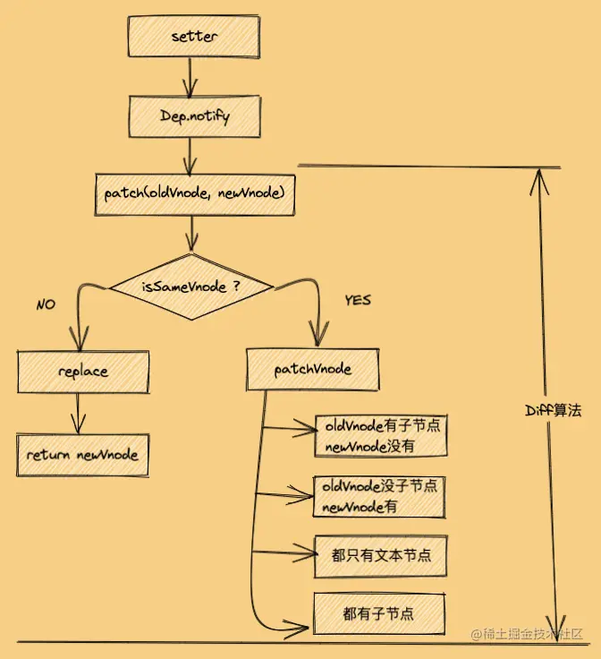

# Diff 算法

Diff 算法是一种对比算法。对比新虚拟 Dom 和旧虚拟 Dom,找出更改的虚拟节点,并只更新这个虚拟节点对应的真实节点,而不用更新其他数据没发生改变的节点,实现精准的更新真实 Dom,进而提高效率。新旧虚拟 Dom 对比的时候,只会在同层级进行,不会跨层级比较

## Diff 对比流程

当数据改变时，会触发 setter，并且通过 Dep.notify 去通知所有订阅者 Watcher，订阅者们就会调用 patch 方法，给真实 DOM 打补丁，更新相应的视图。



### patch 方法

对比当前同层的虚拟节点是否为同一种类型的标签

- 是：继续执行**patchVnode**方法进行深层比对
- 否：没有必要对比，直接整个节点替换成新虚拟节点

```
function patch(oldVnode, newVnode) {
  // 比较是否为一个类型的节点
  if (sameVnode(oldVnode, newVnode)) {
    // 是：继续进行深层比较
    patchVnode(oldVnode, newVnode)
  } else {
    // 否
    const oldEl = oldVnode.el // 旧虚拟节点的真实DOM节点
    const parentEle = api.parentNode(oldEl) // 获取父节点
    createEle(newVnode) // 创建新虚拟节点对应的真实DOM节点
    if (parentEle !== null) {
      api.insertBefore(parentEle, vnode.el, api.nextSibling(oEl)) // 将新元素添加进父元素
      api.removeChild(parentEle, oldVnode.el)  // 移除以前的旧元素节点
      // 设置null，释放内存
      oldVnode = null
    }
  }

  return newVnode
}

```

### sameVnode 方法

```
function sameVnode(oldVnode, newVnode) {
  return (
    oldVnode.key === newVnode.key && // key值是否一样
    oldVnode.tagName === newVnode.tagName && // 标签名是否一样
    oldVnode.isComment === newVnode.isComment && // 是否都为注释节点
    isDef(oldVnode.data) === isDef(newVnode.data) && // 是否都定义了data
    sameInputType(oldVnode, newVnode) // 当标签为input时，type必须是否相同
  )
}

```

### updateChildren 方法

新旧虚拟节点首尾各有两个指针 newS、oldS、newE、oldE,然后会进行相互比较，有五种比较情况：

1. oldS 和 newS 使用 sameVnode 方法进行比较，sameVnode(oldS, newS)

2. oldS 和 newE 使用 sameVnode 方法进行比较，sameVnode(oldS, newE)

3. oldE 和 newS 使用 sameVnode 方法进行比较，sameVnode(oldE, newS)

4. oldE 和 newE 使用 sameVnode 方法进行比较，sameVnode(oldE, newE)

5. 如果以上逻辑都匹配不到，再把所有旧子节点的 key 做一个映射到旧节点下标的 key -> index 表，然后用新 vnode 的 key 去找出在旧节点中可以复用的位置。

```
function updateChildren(parentElm, oldCh, newCh) {
  let oldStartIdx = 0, newStartIdx = 0
  let oldEndIdx = oldCh.length - 1
  let oldStartVnode = oldCh[0]
  let oldEndVnode = oldCh[oldEndIdx]
  let newEndIdx = newCh.length - 1
  let newStartVnode = newCh[0]
  let newEndVnode = newCh[newEndIdx]
  let oldKeyToIdx
  let idxInOld
  let elmToMove
  let before
  while (oldStartIdx <= oldEndIdx && newStartIdx <= newEndIdx) {
    if (oldStartVnode == null) {
      oldStartVnode = oldCh[++oldStartIdx]
    } else if (oldEndVnode == null) {
      oldEndVnode = oldCh[--oldEndIdx]
    } else if (newStartVnode == null) {
      newStartVnode = newCh[++newStartIdx]
    } else if (newEndVnode == null) {
      newEndVnode = newCh[--newEndIdx]
    } else if (sameVnode(oldStartVnode, newStartVnode)) {
      patchVnode(oldStartVnode, newStartVnode)
      oldStartVnode = oldCh[++oldStartIdx]
      newStartVnode = newCh[++newStartIdx]
    } else if (sameVnode(oldEndVnode, newEndVnode)) {
      patchVnode(oldEndVnode, newEndVnode)
      oldEndVnode = oldCh[--oldEndIdx]
      newEndVnode = newCh[--newEndIdx]
    } else if (sameVnode(oldStartVnode, newEndVnode)) {
      patchVnode(oldStartVnode, newEndVnode)
      api.insertBefore(parentElm, oldStartVnode.el, api.nextSibling(oldEndVnode.el))
      oldStartVnode = oldCh[++oldStartIdx]
      newEndVnode = newCh[--newEndIdx]
    } else if (sameVnode(oldEndVnode, newStartVnode)) {
      patchVnode(oldEndVnode, newStartVnode)
      api.insertBefore(parentElm, oldEndVnode.el, oldStartVnode.el)
      oldEndVnode = oldCh[--oldEndIdx]
      newStartVnode = newCh[++newStartIdx]
    } else {
      // 使用key时的比较
      if (oldKeyToIdx === undefined) {
        oldKeyToIdx = createKeyToOldIdx(oldCh, oldStartIdx, oldEndIdx) // 有key生成index表
      }
      idxInOld = oldKeyToIdx[newStartVnode.key]
      if (!idxInOld) {
        api.insertBefore(parentElm, createEle(newStartVnode).el, oldStartVnode.el)
        newStartVnode = newCh[++newStartIdx]
      }
      else {
        elmToMove = oldCh[idxInOld]
        if (elmToMove.sel !== newStartVnode.sel) {
          api.insertBefore(parentElm, createEle(newStartVnode).el, oldStartVnode.el)
        } else {
          patchVnode(elmToMove, newStartVnode)
          oldCh[idxInOld] = null
          api.insertBefore(parentElm, elmToMove.el, oldStartVnode.el)
        }
        newStartVnode = newCh[++newStartIdx]
      }
    }
  }
  if (oldStartIdx > oldEndIdx) {
    before = newCh[newEndIdx + 1] == null ? null : newCh[newEndIdx + 1].el
    addVnodes(parentElm, before, newCh, newStartIdx, newEndIdx)
  } else if (newStartIdx > newEndIdx) {
    removeVnodes(parentElm, oldCh, oldStartIdx, oldEndIdx)
  }
}

```

### 为什么 key 值不建议用 index

- 用 index 作为 key 时，在对数据进行，逆序添加，逆序删除等破坏顺序的操作时，会产生没必要的真实 DOM 更新，从而导致效率低
- 用 index 作为 key 时，如果结构中包含输入类的 DOM，会产生错误的 DOM 更新
- 如果不对数据进行逆序添加 逆序删除破坏顺序的操作， 只用于列表展示的话 使用 index 作为 Key 没有毛病

### 参考链接

[Diff 核心原理](https://juejin.cn/post/6994959998283907102?searchId=20240306163033AA7298EE72504E114784)
